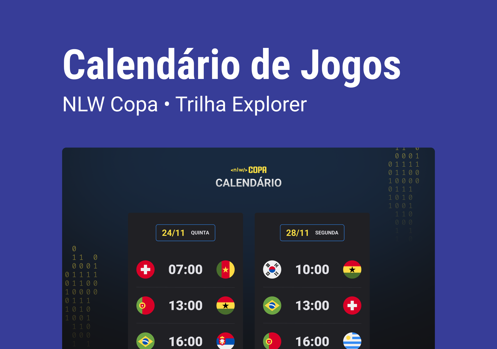

# Rocketseat | NLW Copa | Trilha Explorer

   

## Sobre a NLW

A Next Level Week é um evento online e gratuito, promovido periodicamente pela [Rocketseat](https://github.com/Rocketseat), sempre com a proposta de desenvolvimento de aplicações na prática, do zero, em uma semana.

A NLW Copa foi a última edição de 2022 e teve a temática da Copa do Mundo. O evento ocorreu entre 31/10 e 04/11 e contou com duas trilhas: Explorer, para iniciantes; e Ignite, para desenvolvedores mais avançados.

## Projeto e layout

O Calendário de Jogos foi o projeto proposto para a Trilha Explorer da NLW Copa, guiada por [Mayk Brito](https://github.com/maykbrito).

Ele consiste em um website que exibe as partidas previstas para serem disputadas na próxima Copa do Mundo. O resultado final pode ser [acessado online aqui](https://bpires.github.io/nlw-copa-explorer/).

- [layout original do projeto (Figma)](https://www.figma.com/community/file/1169028052212317700)
- [material complementar (Notion)](https://efficient-sloth-d85.notion.site/NLW-10-Copa-235da64b014048b4a4c25229b67ecb12)

| **Stacks utilizadas** | **Ambiente de desenv.** | **Layout** |
| --- | --- | --- |
|  |  |  |

### Como contribuir

Como esse projeto se trata apenas de um exercício, ele não está aberto a PRs. No entanto, ficaria extremamente grato com qualquer feedback, seja uma opinião, sugestão de melhoria ou erro encontrado. Você pode fazer isso [abrindo uma issue](https://github.com/bpires/nlw-copa-explorer/issues/new).

---

[MIT © 2022](https://github.com/bpires/nlw-copa-explorer/blob/main/LICENSE) · Rafael B. Pires

